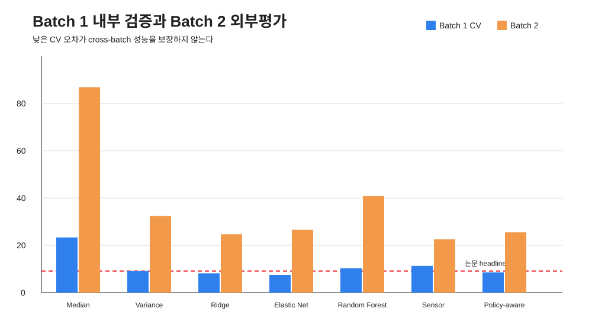
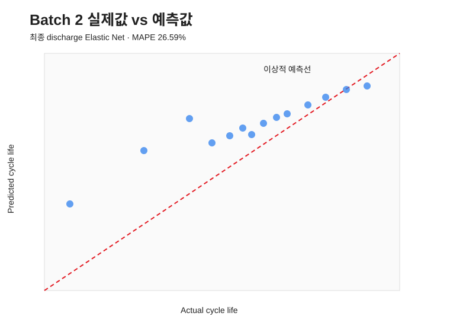

# 성능 및 해석 보고서

## 실험 계약

- 개발: Batch 1, 41 cells
- 고정 Target-Test: Batch 2, 43 cells
- 타깃: 최종 Cycle Life
- feature window: cycle 2–100
- 모델 선택: 5-fold × 10-repeat CV 후 protocol-group CV 안정성 확인
- Batch 2 결과를 보고 후보·하이퍼파라미터를 변경하지 않음

## 최종 성능

최종 `discharge_elasticnet`의 Batch 2 성능은 MAPE 26.59%, RMSE 129.34 cycles,
MAE 115.78 cycles, Median APE 22.95%, R² -1.90이다. 음의 R²는 Batch 2 평균만
예측하는 기준보다 제곱오차가 크다는 뜻이다. 이를 감추지 않고 분포 이동 실패로 해석했다.

부트스트랩 95% CI는 MAPE 21.19–34.02%, RMSE 111.33–147.26 cycles,
MAE 98.93–133.16 cycles다. 90% conformal 구간 반경은 ±178.07 cycles이며,
실제 coverage는 83.72%였다.

## 논문 대비 GAP

| 비교 기준 | 논문 | 본 프로젝트 | GAP |
|---|---:|---:|---:|
| 과제 지정 headline test error | 9.1% | 26.59% | +17.49%p |
| Table 1 discharge / primary / all cells | 13.0% | 26.59% | +13.59%p |
| Table 1 full / primary / all cells | 14.1% | 26.59% | +12.49%p |
| Table 1 full / anomaly 제외 | 7.5% | 26.59% | 비교 부적절 |

9.1%, 13.0%, 7.5%는 같은 평가셋·피처·이상치 규칙이 아니다. 과제의 9.1% GAP은
그대로 보고하되, 원인 분석은 all-cell primary test의 13.0%를 보조 기준으로 삼았다.

## 실패 원인 가설과 검증 근거

1. **Target shift**: Batch 1 중앙값 842, Batch 2 중앙값 481 cycles.
2. **Covariate shift**: `dq_mean`, `cap_diff_100_2`, `cap_c100`의 |SMD|가 1.4 이상.
3. **극단 셀**: `b2c1` 하나의 APE가 148.8%; 단, 제거하지 않고 민감도 대상으로만 표시.
4. **작은 n**: 41개 셀에서 10개 피처와 하이퍼파라미터를 선택하므로 추정 변동이 큼.
5. **프로토콜 confounding**: 처리 조건을 건강 신호로 해석하면 새 운용 조건에 일반화하기 어려움.

## 다음 실험 우선순위

1. 원본 `.mat`에서 official loader와 동일한 셀 매핑으로 Batch 3를 재추출해 완전 외부 평가.
2. leave-one-protocol-out CV와 계층 Bayes/partial pooling으로 정책 간 이동을 정면 모델링.
3. Batch 1 내부 calibration이 아니라 batch-aware 또는 weighted conformal interval 적용.
4. `b2c1`을 포함/제외한 두 점수를 함께 제시하고 원데이터 품질·knee 위치를 확인.
5. 화학계·온도·SOC window가 다른 공개 데이터셋에서 transportability 검증.

